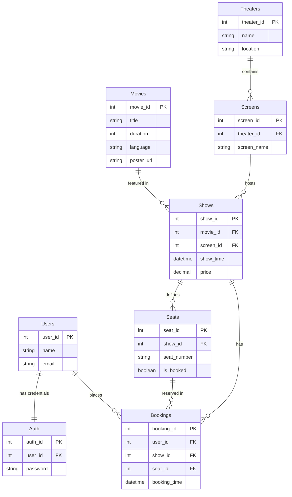

# Database Schema Diagram

This document provides a detailed overview of the database schema for the Movie Ticket Booking System.

## Entity Relationship Diagram

The following Mermaid diagram illustrates the relational structure of the database:

## Table Breakdown

### 1. Users
Stores basic user information.
- `user_id`: Primary Key, unique identifier for each user.
- `name`: Full name of the user.
- `email`: Email address (used for identification).

### 2. Auth
Stores authentication credentials, separated from the main `Users` table for security and performance.
- `auth_id`: Primary Key.
- `user_id`: Foreign Key referencing `Users(user_id)`.
- `password`: Hashed password string.

### 3. Movies
Contains details about the movies available for booking.
- `movie_id`: Primary Key.
- `title`: Name of the movie.
- `duration`: Length of the movie in minutes.
- `language`: Primary language of the movie.
- `poster_url`: Link to the movie's promotional poster.

### 4. Theaters
Represents the physical cinema locations.
- `theater_id`: Primary Key.
- `name`: Name of the theater.
- `location`: Physical address or city.

### 5. Screens
Individual screens within a theater.
- `screen_id`: Primary Key.
- `theater_id`: Foreign Key referencing `Theaters(theater_id)`.
- `screen_name`: Name or number of the screen (e.g., "Screen 1", "Gold Class").

### 6. Shows
Maps a movie to a specific screen and time.
- `show_id`: Primary Key.
- `movie_id`: Foreign Key referencing `Movies(movie_id)`.
- `screen_id`: Foreign Key referencing `Screens(screen_id)`.
- `show_time`: Date and time of the performance.
- `price`: Base ticket price for the show.

### 7. Seats
Tracks the availability of individual seats for each show.
- `seat_id`: Primary Key.
- `show_id`: Foreign Key referencing `Shows(show_id)`.
- `seat_number`: Alphanumeric code for the seat (e.g., "A1", "R10").
- `is_booked`: Boolean flag indicating if the seat is reserved.

### 8. Bookings
The transaction ledger recording confirmed reservations.
- `booking_id`: Primary Key.
- `user_id`: Foreign Key referencing `Users(user_id)`.
- `show_id`: Foreign Key referencing `Shows(show_id)`.
- `seat_id`: Foreign Key referencing `Seats(seat_id)`.
- `booking_time`: Timestamp of when the booking was made.
